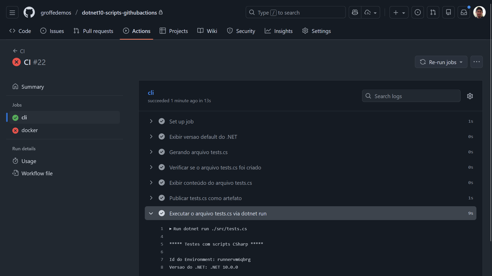
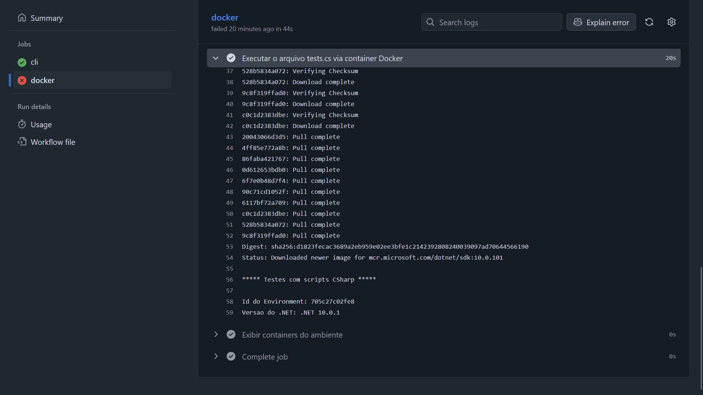

# dotnet10-scripts-githubactions-docker
 
Pipeline do GitHub Actions demonstrando o uso de C# com scripts + Docker no .NET 10.

## Resultados dos testes

Execução do script via .NET CLI:

```bash
dotnet run ./src/tests.cs
```



O mesmo script executado a partir de um containe (via docker run):

```bash
docker run --name container01 -v ${GITHUB_WORKSPACE}/src:/src mcr.microsoft.com/dotnet/sdk:10.0.101 bash -c "dotnet run /src/tests.cs"
```


